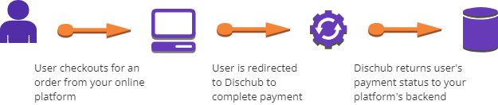

# Dischub PHP Package for 3-Step

This package provides an easy way to integrate with Dischub's API for order creation and payment handling in Laravel applications.

## Installation

You can install the package using Composer:

```sh
composer require ngoni/dischub-php
```

If you encounter stability issues, install with:

```sh
composer require ngoni/dischub-php:dev-main
```

Then, publish the configuration file:

```sh
php artisan vendor:publish --provider="Ngoni\DischubPhp\DischubServiceProvider"
```

## Configuration

After publishing, the configuration file is located at `config/dischub.php`. Update your `.env` file with:

```env
DISCHUB_API_KEY=your_api_key_here
DISCHUB_NOTIFY_URL=https://yourdomain.com/dischub/callback
DISCHUB_RECIPIENT=your_recipient_email@example.com
```

## Usage

### Import the Service in a Controller

In your Laravel controller, you can use the `DischubService` to create an order and redirect the user to payment:

```php
use Illuminate\Http\Request;
use Ngoni\DischubPhp\DischubService;

class OrderController extends Controller
{
    protected $dischubService;

    public function __construct(DischubService $dischubService)
    {
        $this->dischubService = $dischubService;
    }

    /**
     * Create an order and redirect to payment.
     */
    public function createOrder(Request $request)
    {
        $validated = $request->validate([
            'order_id'  => 'required|numeric|unique:orders,order_id',
            'sender'    => 'required|email',
            'amount'    => 'required|numeric|min:0.01|max:480',
            'currency'  => 'required|in:USD,ZWG',
        ]);

        $response = $this->dischubService->createOrder($validated);

        if ($response['status'] === 'success') {
            return redirect($this->dischubService->getPaymentUrl($validated['order_id']));
        }

        return back()->with('error', $response['message']);
    }
}
```

### Handling the Callback

Dischub will send a callback when a transaction is processed. Handle it in your controller:

```php
use Illuminate\Http\Request;
use Illuminate\Support\Facades\Log;

class PaymentController extends Controller
{
    public function receiveDischubCallback(Request $request)
    {
        if ($request->isMethod('post')) {
            $data = json_decode($request->getContent(), true);
            Log::info('Dischub Callback Data:', $data ?? []);

            return response()->json([
                'message' => 'Callback received successfully',
                'data'    => $data ?? []
            ], 200);
        }

        return response()->json(['error' => 'Invalid request method'], 405);
    }
}
```

## License

This package is open-source and available under the [MIT License](LICENSE).

